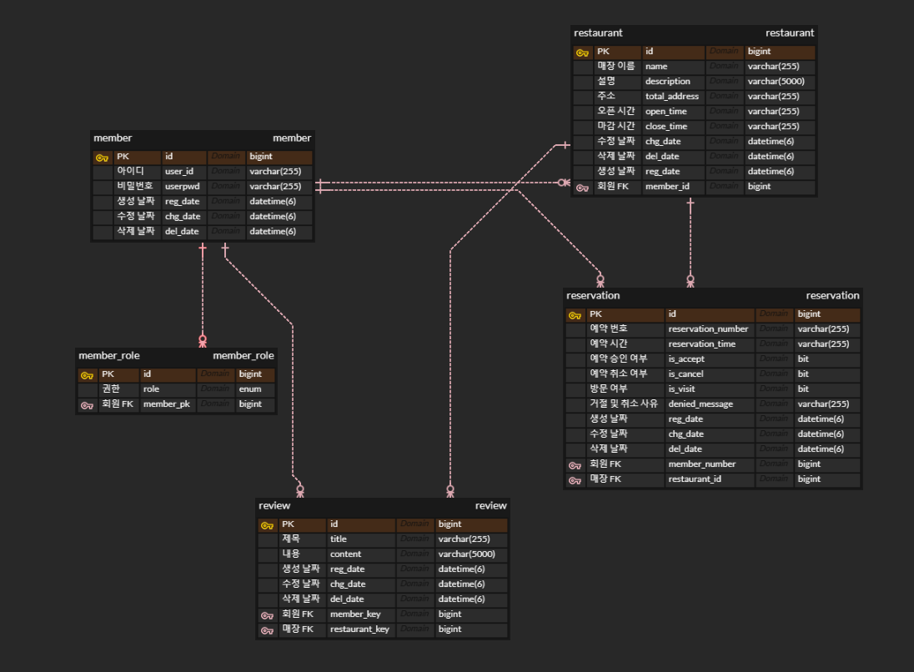

# 매장 테이블 예약 서비스 api 설계 프로젝트

매장의 점장은 매장 정보를 등록하고 회원은 원하는 매장을 예약하며, 매장 이용 후 리뷰를 작성할 수 있는 서비스를 제공하는 api 설계 프로젝트

# 프로젝트 기간

2024.05.20 ~ 2024.06.xx

# 기술 스택

- SpringBoot 3.2.5
- SpringSecurity
- Redis
- Java 17
- JPA
- MySql

# 구현 기능

- 점장(매장의 관리자)이 매장 정보를 등록하는 기능 -> 매장 CRUD
- 회원이 매장을 검색하고 상세 정보를 조회하는 기능
- 회원이 예약하고자 하는 매장에 예약을 진행하는 기능 -> 예약 CRD
- 예약 후 점장(매장의 관리자)이 승인을 완료해야 예약이 완료되는 기능
- 예약 완료 후 예약 시간 10분 전까지 매장에 방문하여 방문 인증을 진행하는 기능
- 매장 이용 후 리뷰를 작성하는 기능 -> 리뷰 CRUD
- 회원 권한 부여(점장 : ADMIN, 회원 : READ, 리뷰 작성 가능 : WRITE)
- Redis를 통해 상세 정보 조회 시 시간 단축
- RestControllerAdvice를 통한 400, 401, 403, 404, 405, 500 에러
  핸들링 -> [ExceptionHandler](https://github.com/JinhwanB/restaurantreservationpj/blob/main/src/main/java/com/jh/restaurantreservationpj/config/GlobalExceptionHandler.java)

# ERD

# 최종 구현 API

## 회원

✅ POST - auth/signup (회원 가입)

- 아이디와 비밀번호, 권한(admin, read, write)을 RequestBody로 받고 회원 아이디를 반환
- 

    
에러

  > - 아이디 또는 비밀번호 또는 권한이 비어있을 시 400 status 코드와 에러메시지 반환
  >- 아이디가 중복인 경우 400 status 코드와 에러메시지 반환
  

✅ POST - auth/signin (로그인)

- 아이디와 비밀번호를 RequestBody로 받고 토큰을 반환
- 

    
에러

  > - 아이디 또는 비밀번호가 비어있을 시 400 status 코드와 에러메시지 반환
  >- 회원가입이 안된 아이디일 경우 400 status 코드와 에러메시지 반환
  >- 비밀번호가 다른 경우 400 status 코드와 에러메시지 반환

 

## 매장

✅ POST - restaurants/restaurant (매장 등록)

- 매장 이름, 주소, 설명, 오픈 시간, 마감 시간을 RequestBody로 받고 매장 이름을 반환
- 오픈 시간과 마감 시간은 문자열로 받음 (예: 00 ~ 23)
- 

    
에러

  > - 오픈 시간과 마감 시간이 모두 null 인 경우 24시간 운영 하지만 한 쪽만 null 인 경우 400 status 코드와 에러메시지 반환
  >- RequestBody의 필드 중 빈 문자열인 경우 400 status 코드와 에러메시지 반환
  >- 로그인을 안 했을 시 401 status 코드와 에러메시지, 권한이 없을 시 403 status 코드와 에러메시지 반환
  >- 회원이 아닌 경우 400 status 코드와 에러메시지 반환
  >- 중복된 매장 이름인 경우 400 status 코드와 에러메시지 반환

 

✅ PUT - restaurants/restaurant/{restaurantName} (매장 수정)

- 매장 이름을 PathVariable로 수정할 내용(매장 이름, 주소, 설명, 오픈 시간, 마감 시간)을 RequestBody로 받고 변경된 내용을 반환
- 오픈 시간과 마감 시간은 문자열로 받음 (예: 00 ~ 23)
- 

    
에러

  > - 오픈 시간과 마감 시간이 모두 null 인 경우 24시간 운영 하지만 한 쪽만 null 인 경우 400 status 코드와 에러메시지 반환
  >- 매장 이름이 빈 문자열인 경우 400 status 코드와 에러메시지 반환
  >- RequestBody의 필드 중 빈 문자열인 경우 400 status 코드와 에러메시지 반환
  >- 로그인을 안 했을 시 401 status 코드와 에러메시지, 권한이 없을 시 403 status 코드와 에러메시지 반환
  >- 없는 매장인 경우 400 status 코드와 에러메시지 반환
  >- 매장의 관리자가 아닌 경우 400 status 코드와 에러메시지 반환
  >- 수정할 매장의 이름이 이미 존재하는 매장인 경우 400 status 코드와 에러메시지 반환

 

✅ DELETE - restaurants/restaurant/{restaurantName} (매장 삭제)

- 매장 이름을 PathVariable로 받고 삭제된 매장 이름을 반환
- 

    
에러

  > - 매장 이름이 빈 문자열인 경우 400 status 코드와 에러메시지 반환
  >- 로그인을 안 했을 시 401 status 코드와 에러메시지, 권한이 없을 시 403 status 코드와 에러메시지 반환
  >- 없는 매장인 경우 400 status 코드와 에러메시지 반환
  >- 매장의 관리자가 아닌 경우 400 status 코드와 에러메시지 반환

 

✅ GET - restaurants/search (매장 검색)

- 검색어를 RequestParam으로 받고 매장 리스트를 반환
- 검색한 문자로 시작하거나 문자를 포함한 매장을 오름차순으로 정렬하고 페이징 처리하여 반환
- 

    
에러

  > - 검색어가 빈 문자열인 경우 400 status 코드와 에러메시지 반환

 

✅ GET - restaurants/restaurant/{restaurantName} (매장 상세 조회)

- 매장 이름을 PathVariable로 받고 매장 상세 정보를 반환
- 

    
에러

  > - 매장 이름이 빈 문자열인 경우 400 status 코드와 에러메시지 반환
  >- 없는 매장인 경우 400 status 코드와 에러메시지 반환

 

✅ GET - restaurants (매장 전체 리스트 조회)

- 매장 전체 리스트를 이름을 기준으로 오름차순 정렬하고 페이징 처리하여 반환

## 예약

✅ POST - reservations/reservation (예약 생성)

- 매장 이름과 예약 시간을 RequestBody로 받고 예약 번호와 예약한 회원의 아이디와 예약한 매장 이름과 예약 시간을 반환
- 예약은 당일 예약만 가능
- 

    
에러

  > - 로그인을 안 했을 시 401 status 코드와 에러메시지, 권한이 없을 시 403 status 코드와 에러메시지 반환
  >- 매장 이름과 예약 시간이 빈 문자열인 경우 400 status 코드와 에러메시지 반환
  >- 예약 시간이 두 자리의 숫자 형식의 문자열이 아닌 경우 400 status 코드와 에러메시지 반환
  >- 회원이 아니거나 없는 매장인 경우 400 status 코드와 에러메시지 반환
  >- 이미 같은 매장에 예약이 진행 중이라면 400 status 코드와 에러메시지 반환
  >- 현재 시간 이전 또는 매장 오픈 시간 이전 또는 매장 마감 시간 이후로 예약하려는 경우 400 status 코드와 에러메시지 반환

 

✅ DELETE - reservations/reservation (예약 취소)

- 예약 번호와 취소 사유를 RequestBody로 받고 최소된 예약 상세 정보를 반환
- 예약 시간 1시간 전까지 취소 가능
- 

    
에러

  > - 로그인을 안 했을 시 401 status 코드와 에러메시지, 권한이 없을 시 403 status 코드와 에러메시지 반환
  >- 예약 번호 또는 취소 사유의 문자열이 빈 문자열인 경우 400 status 코드와 에러메시지 반환
  >- 예약 번호가 8자리 숫자 형식의 문자열이 아닌 경우 400 status 코드와 에러메시지 반환
  >- 회원이 아니거나 없는 예약인 경우 400 status 코드와 에러메시지 반환
  >- 이미 방문 인증 시간이 지난 경우 자동 취소 처리와 400 status 코드와 에러메시지 반환
  >- 예약한 회원과 다른 경우 400 status 코드와 에러메시지 반환
  >- 예약 1시간 전보다 이후에 취소하는 경우 400 status 코드와 에러메시지 반환

 

✅ PUT - reservations/reservation/{reservationNumber} (예약 승인)

- 예약 번호를 PathVariable로 받고 예약 상세 정보를 반환
- 

    
에러

  > - 로그인을 안 했을 시 401 status 코드와 에러메시지, 권한이 없을 시 403 status 코드와 에러메시지 반환
  >- 예약 번호가 빈 문자열이거나 8자리 숫자 형식의 문자열이 아닌 경우 400 status 코드와 에러메시지 반환
  >- 회원이 아니거나 없는 예약인 경우 400 status 코드와 에러메시지 반환
  >- 예약한 매장의 관리자가 아닌 경우 400 status 코드와 에러메시지 반환
  >- 이미 방문 인증 시간이 지난 경우 자동 취소 처리와 400 status 코드와 에러메시지 반환

 

✅ PUT - reservations/reservation (예약 거절)

- 예약 번호와 거절 사유를 RequestBody로 받고 예약 상세 정보를 반환
- 

    
에러

  > - 로그인을 안 했을 시 401 status 코드와 에러메시지, 권한이 없을 시 403 status 코드와 에러메시지 반환
  >- 예약 번호가 빈 문자열이거나 8자리 숫자 형식의 문자열이 아닌 경우 400 status 코드와 에러메시지 반환
  >- 거절 사유가 빈 문자열인 경우 400 status 코드와 에러메시지 반환
  >- 회원이 아니거나 없는 예약인 경우 400 status 코드와 에러메시지 반환
  >- 예약한 매장의 관리자가 아닌 경우 400 status 코드와 에러메시지 반환
  >- 이미 방문 인증 시간이 지난 경우 자동 취소 처리와 400 status 코드와 에러메시지 반환

 

✅ PUT - reservations/reservation/visit (방문 인증)

- 회원 아이디와 예약 번호와 매장 이름을 RequestBody로 받고 예약 상세 정보를 반환
- 

    
에러

  > - 예약 번호가 빈 문자열이거나 8자리 숫자 형식의 문자열이 아닌 경우 400 status 코드와 에러메시지 반환
  >- 회원 아이디 또는 매장 이름이 빈 문자열인 경우 400 status 코드와 에러메시지 반환
  >- 회원이 아니거나 없는 예약인 경우 400 status 코드와 에러메시지 반환
  >- 이미 방문 인증 시간이 지난 경우 자동 취소 처리와 400 status 코드와 에러메시지 반환
  >- 승인된 예약이 아닌 경우 400 status 코드와 에러메시지 반환
  >- 예약한 회원과 다른 경우 400 status 코드와 에러메시지 반환
  >- 예약한 매장이 아닌 경우 400 status 코드와 에러메시지 반환

 

✅ GET - reservations/reservation/search/{reservationNumber} (예약 상세 조회)

- 예약 번호를 PathVariable로 받고 예약 상세 정보를 반환
- 

    
에러

  > - 예약 번호가 빈 문자열이거나 8자리 숫자 형식의 문자열이 아닌 경우 400 status 코드와 에러메시지 반환
  >- 로그인을 안 했을 시 401 status 코드와 에러메시지, 권한이 없을 시 403 status 코드와 에러메시지 반환
  >- 회원이 아니거나 없는 예약인 경우 400 status 코드와 에러메시지 반환
  >- 관리자가 조회했을 시 예약 정보의 매장의 관리자가 아닌 경우 400 status 코드와 에러메시지 반환
  >- 회원이 조회했을 시 예약 정보의 회원이 아닌 경우 400 status 코드와 에러메시지 반환

 

✅ GET - reservations/search/{restaurantName} (점장이 예약 목록을 조회)

- 매장 이름을 PathVariable로 받고 조회된 예약 목록을 반환
- 먼저 예약한 순으로 정렬, 페이징 처리하여 반환
- 

    
에러

  > - 로그인을 안 했을 시 401 status 코드와 에러메시지, 권한이 없을 시 403 status 코드와 에러메시지 반환
  >- 매장 이름이 빈 문자열인 경우 400 status 코드와 에러메시지 반환
  >- 회원이 아니거나 없는 매장인 경우 400 status 코드와 에러메시지 반환
  >- 매장의 관리자가 아닌 경우 400 status 코드와 에러메시지 반환

 

✅ GET - reservations/search (회원이 예약 목록을 조회)

- 예약 목록을 반환
- 

    
에러

  > - 로그인을 안 했을 시 401 status 코드와 에러메시지, 권한이 없을 시 403 status 코드와 에러메시지 반환
  >- 회원이 아닌 경우 400 status 코드와 에러메시지 반환
  >- 매장의 관리자가 아닌 경우 400 status 코드와 에러메시지 반환

 

## 리뷰

✅ POST - reviews/review (리뷰 생성)

- 매장 이름과 제목, 내용을 RequestBody로 받고 작성된 리뷰의 PK와 제목과 내용을 반환
- 

    
에러

  > - 로그인을 안 했을 시 401 status 코드와 에러메시지, 권한이 없을 시 403 status 코드와 에러메시지 반환
  >- 매장 이름 또는 제목 또는 내용이 빈 문자열인 경우 400 status 코드와 에러메시지 반환
  >- 회원이 아닌 경우 또는 없는 매장인 경우 400 status 코드와 에러메시지 반환

 

✅ PUT - reviews/review/{id} (리뷰 수정)

- 수정할 리뷰의 PK를 PathVariable로 받고 수정할 제목과 내용을 RequestBody로 받고 수정된 리뷰의 상세 정보를 반환
- 

    
에러

  > - 로그인을 안 했을 시 401 status 코드와 에러메시지, 권한이 없을 시 403 status 코드와 에러메시지 반환
  >- PK가 0 또는 음수인 경우 400 status 코드와 에러메시지 반환
  >- 제목 또는 내용이 빈 문자열인 경우 400 status 코드와 에러메시지 반환
  >- 회원이 아닌 경우 또는 없는 리뷰인 경우 400 status 코드와 에러메시지 반환
  >- 리뷰의 작성자와 다른 경우 400 status 코드와 에러메시지 반환

 

✅ DELETE - reviews/review/{id} (리뷰 삭제)

- 삭제할 리뷰 PK를 PathVariable로 받고 삭제된 리뷰의 PK를 반환
- 

    
에러

  > - 로그인을 안 했을 시 401 status 코드와 에러메시지, 권한이 없을 시 403 status 코드와 에러메시지 반환
  >- PK가 0 또는 음수인 경우 400 status 코드와 에러메시지 반환
  >- 회원이 아닌 경우 또는 없는 리뷰인 경우 400 status 코드와 에러메시지 반환
  >- 회원이 삭제하는 경우 리뷰의 작성자와 다른 경우 400 status 코드와 에러메시지 반환
  >- 관리자가 삭제하는 경우 리뷰가 작성된 매장의 관리자가 아닌 경우 400 status 코드와 에러메시지 반환

 

✅ GET - reviews/search/{id} (리뷰 상세 조회)

- 조회할 리뷰의 PK를 PathVariable로 받고 조회된 리뷰의 상세 정보 반환
- 

    
에러

  > - PK가 0 또는 음수인 경우 400 status 코드와 에러메시지 반환
  >- 없는 리뷰인 경우 400 status 코드와 에러메시지 반환

 

✅ GET - reviews/search (리뷰 전체 리스트 조회)

- 리뷰의 전체 리스트를 반환